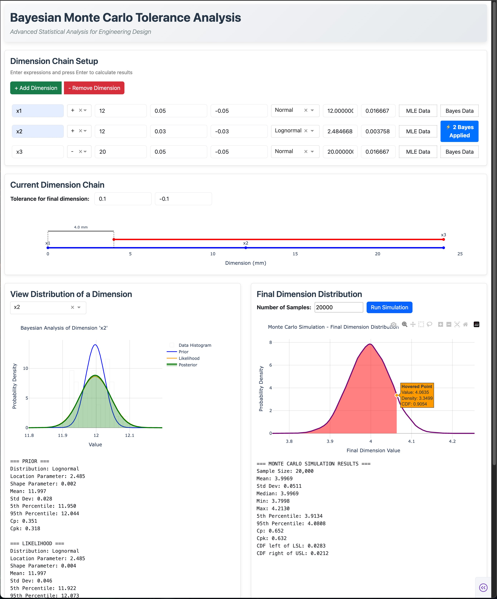

# BayesTolSim

**A modern dashboard for tolerance analysis powered by Monte Carlo simulation and Bayesian statistics.**

Supports:

- Traditional Six Sigma methods  
- Maximum Likelihood Estimation (MLE)  
- Iterative Bayesian modeling  



---

## Overview

**BayesTolSim** is a web-based tool that brings a new level of precision to engineering tolerance analysis by combining:

1. **Six Sigma Techniques** — Standard approach using normal distribution and Cp/Cpk metrics  
2. **Maximum Likelihood Estimation (MLE)** — Fit statistical distributions directly to production data  
3. **Bayesian Modeling** — Update prior specifications with trial or prototype data using Bayesian inference  

This three-stage workflow helps engineers make smarter decisions by combining design intent with real-world measurements.

---

## Key Statistical Methods

### 1. Six Sigma (Traditional)
- Analyze tolerances using the **normal distribution**
- Auto-calculate:  
  - Mean (μ) = nominal  
  - Std. deviation (σ) = tolerance range / 6
- Evaluate process capability with **Cp, Cpk**
- Run **Monte Carlo simulations** across dimension chains

### 2. Maximum Likelihood Estimation (MLE)
- Fit statistical distributions to **real production data**
- Supports multiple distributions:  
  **Normal**, **Gamma**, **Lognormal**, **Uniform**
- Replace design assumptions with **data-driven estimates**
- Overlay fitted distributions on histograms for comparison

### 3. Bayesian Modeling (Advanced)
- Use **design specs** as priors  
- Update with **trial sample data** (likelihood)
- Produce **posterior distributions** showing updated parameter estimates
- Visualize prior, likelihood, and posterior in a **three-curve plot**
- Supports **sequential updates** as new data arrives

---

## Statistical Workflow

### Stage 1: Traditional Analysis
Start with **Six Sigma** to establish baseline capability using design tolerances.

### Stage 2: Data-Driven Refinement
Apply **MLE** to fit empirical distributions using historical production data.

### Stage 3: Bayesian Integration
Combine **prior specs** with **trial samples measurements** for optimal estimates and uncertainty quantification.

## Local Installation

### Prerequisites
- Python 3.11 or higher
- Conda (recommended) or pip package manager

### Setup

1. **Clone the repository**
  ```bash
  git clone https://github.com/Green-zy/BayesTolSim.git
  cd BayesTolSim
  ```

2. **Install dependencies**
  ```bash
  conda env create -f env.yml
  conda activate tolsim
  ```

3. **Run the application**
  ```bash
  python app.py
  ```

4. **Access the dashboard**
   Open your web browser and navigate to the url shown in the terminal

---

## Usage Guide

### 1. Six Sigma Analysis (Traditional)
- Define dimensions with **nominal values** and **tolerances**
- System auto-calculates **μ and σ** using 6σ rules
- Visualize individual **normal distributions**
- Run **Monte Carlo simulation** for final stack-up
- Review **Cp, Cpk**, and defect rate stats

### 2. MLE Analysis (Production Data)
- Prepare a CSV of **historical measurements**
- Upload via **“MLE Data”** button per dimension
- System fits best distribution using **MLE**
- Compare fitted curve vs. **data histogram**
- Monte Carlo uses **empirical parameters**

### 3. Bayesian Analysis (Advanced)

#### Prior Setup
- Input design specs (nominal ± tolerance) → defines **prior**
- Select a distribution: Normal, Gamma, Lognormal, Uniform

#### Data Integration
- Upload prototype/trial data via **“Bayes Data”**
- Bayesian updating happens automatically
- See **Prior, Likelihood, Posterior** in a single plot

#### Sequential Learning
- Upload new data iteratively
- Posterior updates and uncertainty reduces
- Watch model **refine over time**

### 4. Comparative Insights
- **Six Sigma vs. MLE**: Theory vs. real production data  
- **Prior vs. Posterior**: See how data refines design expectations  
- **Track process evolution** through Bayesian learning

---

## Statistical Comparison

| Method        | Pros                                   | Cons                          |
|---------------|-------------------------------------------|----------------------------------|
| **Six Sigma** | Simple, widely accepted, quick to apply   | Based on normal assumptions             |
| **MLE**       | Fits real data, distribution-agnostic     | Ignores prior design specs; unreliable with small datasets  |
| **Bayesian**  | Combines design specs (prior) with manufacturing data (likelihood); supports sequential updates | Computationally heavier          |

---

## Use Cases by Phase

| Phase             | Applications |
|-------------------|--------------|
| **Design**        | Six Sigma estimates, tolerance allocation |
| **Prototype**     | Bayesian integration, uncertainty quantification |
| **Production**    | MLE validation, sequential Bayesian updates, process monitoring |
| **Product Iteration**     | Carry over prior knowledge to new designs, accelerate ramp-up with Bayesian transfer learning |

---

## Technical Details

### Bayesian Updating (by Distribution)
- **Normal**: Normal-Inverse-Gamma prior
- **Lognormal**: Log-transform + Normal update
- **Gamma**: Gamma-Inverse-Gamma update
- **Uniform**: Posterior via **MCMC sampling**

### Capability Metrics
- **Cp** = (USL - LSL) / (6σ)  
- **Cpk** = min(Cpu, Cpl), accounts for centering  
- **Defect Rate** = P(X < LSL) + P(X > USL)

---

## Contributing

This is a personal project by **Yun Zhou (Robbie)**.  
Suggestions and feedback are welcome!

Email: robbiezhou1@gmail.com  
See `CONTRIBUTING.md` for details.

---

## License

MIT License — see the `LICENSE` file.

---

## Author

**Yun Zhou (Robbie)**  
robbiezhou1@gmail.com  
[GitHub](https://github.com/Green-zy)  

---

## Acknowledgments

Built with:
- **Dash & Plotly** for UI and interactivity  
- **SciPy & PyMC** for statistical modeling  
- **Dash Bootstrap Components** for layout