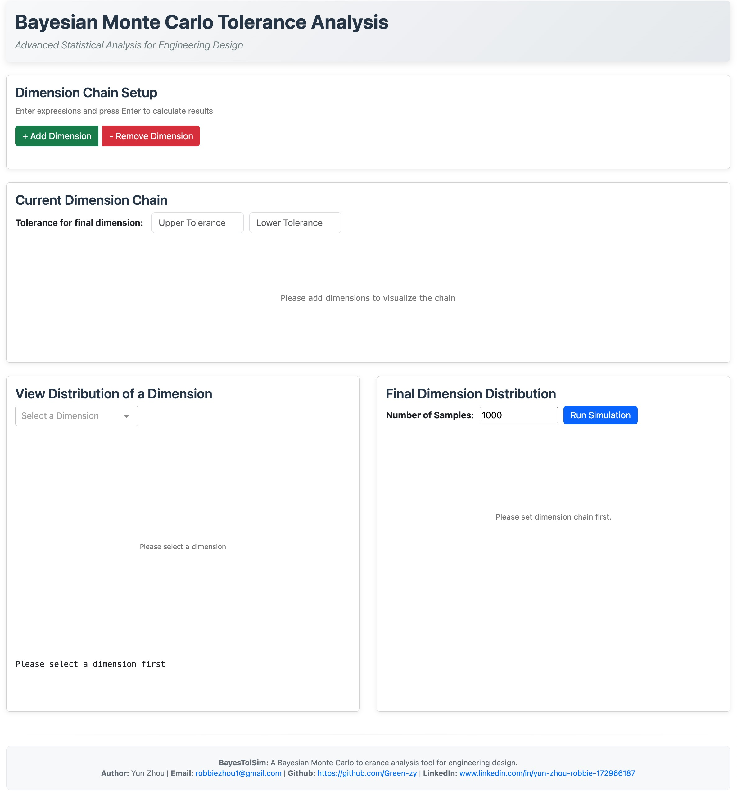
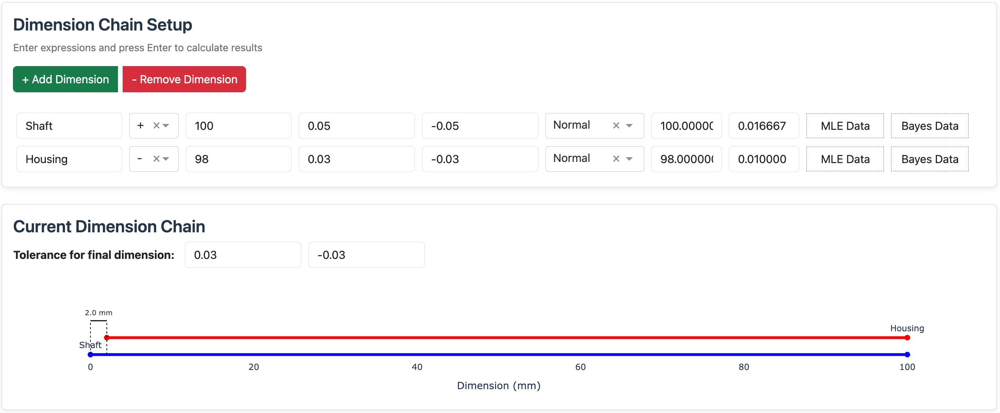
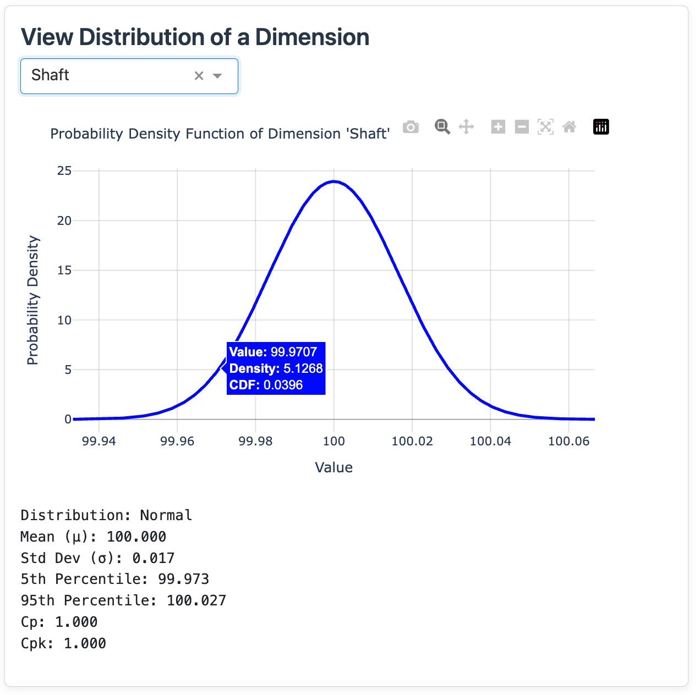
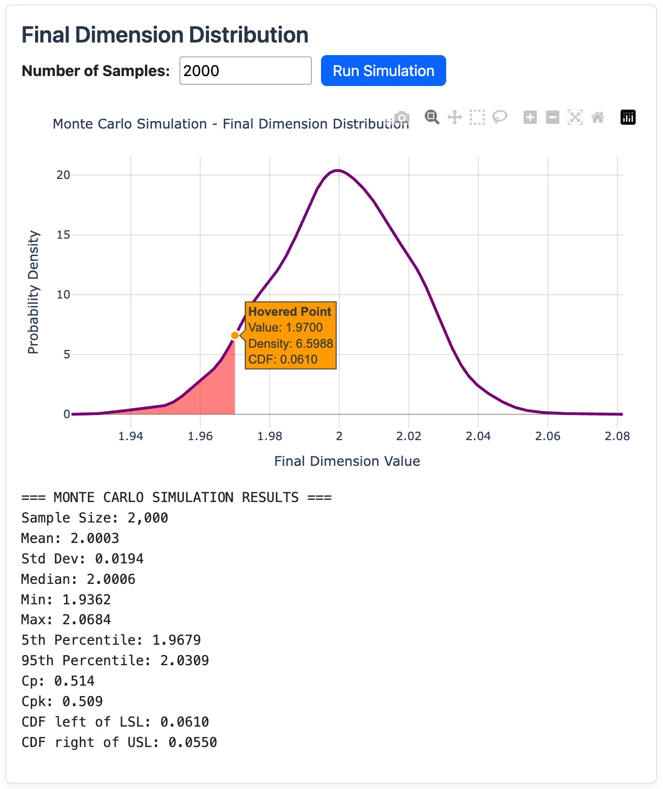

# Getting Started

## Accessing BayesTolSim

BayesTolSim runs in your web browser - no software installation needed.

1. Open your web browser
2. Navigate to the BayesTolSim URL
3. Start your analysis immediately



## Your First Analysis

Let's analyze a simple shaft-housing assembly:

### Step 1: Add Dimensions
1. Click **"+ Add Dimension"** 
2. Fill in the first dimension:
    - **Name**: `Shaft`
    - **Direction**: `+` 
    - **Nominal**: `100`
    - **Upper Tolerance**: `0.05`
    - **Lower Tolerance**: `-0.05`
    - **Distribution**: `Normal`  
        - Defualt mu = nominal, default sigma = (upper - lower) / 6
        - Support manually setting parameters, either values or expressions

3. Add the second dimension:
    - **Name**: `Housing`
    - **Direction**: `-`
    - **Nominal**: `98`
    - **Upper Tolerance**: `0.03`
    - **Lower Tolerance**: `-0.03`
    - **Distribution**: `Normal`  
        - Defualt mu = nominal, default sigma = (upper - lower) / 6
        - Support manually setting parameters, either values or expressions

### Step 2: Set Final Tolerances
1. In the "Current Dimension Chain" section:  
    - **Upper Tolerance**: `0.03`  
    - **Lower Tolerance**: `-0.03`



### Step 3: Check Distributions in Dimension Chain
1. Click on the **"Shaft"** dimension in the dropdown
2. View the distribution plot:
    - Should show a normal distribution centered at 100
    - Check statistics like μ, σ, Cp, Cpk
    - Plot is interactive - hover to see values
3. Repeat for the **"Housing"** dimension



### Step 4: Run Simulation
1. Set **"Number of Samples"**, assume `2000`
2. Click **"Run Simulation"**
3. View your results:
    - Final assembly dimension distribution
    - Important statistical values including Cp, Cpk, Fail rate out of spec
    - Plot is interactive - hover to see values



## Key Features

### Three Analysis Methods

**Normal Analysis (Start Here)**
- Use your design tolerances
- Get instant results
- Industry standard approach

**MLE Analysis (If You Have Data)**
- Upload your measurement data
- See what actually happens in production
- Compare with design assumptions

**Bayesian Analysis (Advanced)**
- Combine design specs with prototype data
- Best of both approaches
- Continuous improvement

### Data Upload (Optional)
If you have measurement data:
- Prepare CSV file with single column
- Column name must match dimension name exactly
- Upload via "MLE Data" or "Bayes Data" buttons

Example CSV format:
```
Shaft_Length
50.023
49.987
50.156
...
```

## Dashboard Layout

**Card 1**: Project header  
**Card 2**: Add and configure dimensions  
**Card 3**: View dimension chain and set final tolerances  
**Card 4**: Analyze individual dimensions  
**Card 5**: Run simulation and view results  

## Quick Tips

- Use descriptive dimension names
- Keep all measurements in mm
- Start with 10,000 samples for good accuracy
- Normal distribution works for most cases
- Check Cp and Cpk values (>1.33 is good)

## Getting Help

- Email: robbiezhou1@gmail.com
- Documentation: Continue reading for detailed guides
- Examples: Step-by-step tutorials available

**Ready to learn more?** Continue to the [User Guide](user-guide/dashboard-overview.md).