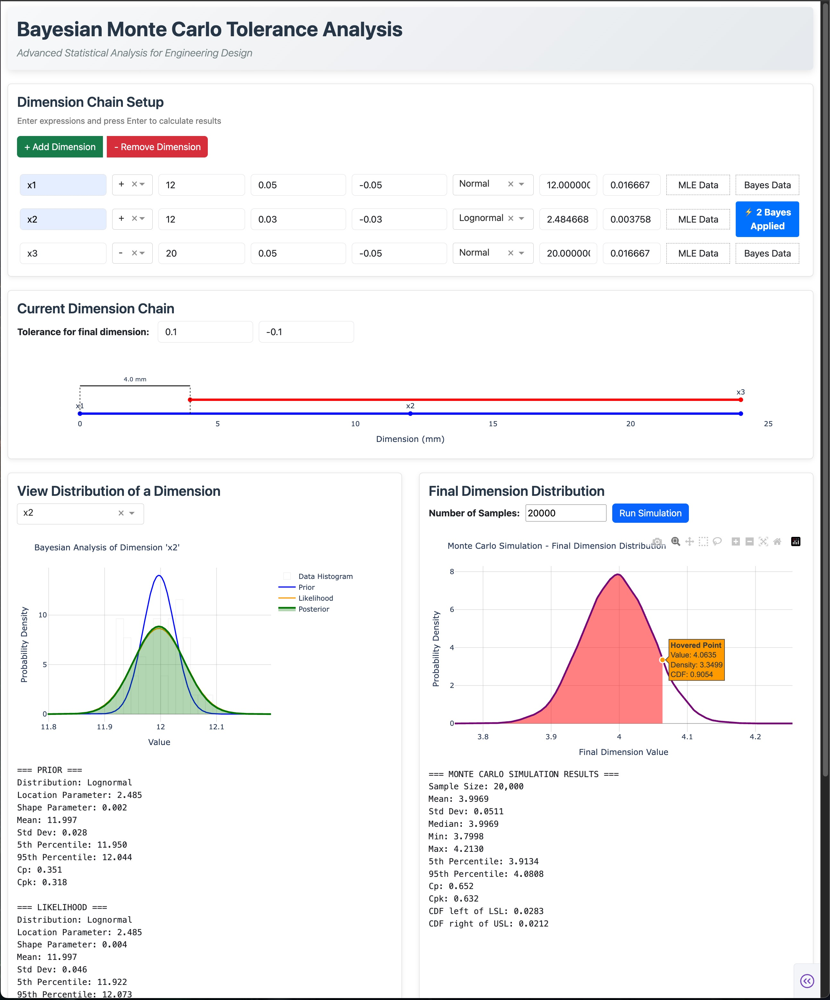

# BayesTolSim Documentation

**Welcome to BayesTolSim** - A modern dashboard for engineering tolerance analysis powered by Monte Carlo simulation and Bayesian statistics.

## What is BayesTolSim?

BayesTolSim provides three approaches to tolerance analysis:

1. **Normal Analysis** - Traditional approach using design tolerances
2. **MLE Analysis** - Fit distributions to production measurement data  
3. **Bayesian Analysis** - Combine design specs with trial data

## Key Features

### Normal Analysis (Traditional)
- Use design tolerances directly
- Automatic parameter calculation
- Industry standard Six Sigma approach
- Instant results

### MLE Analysis (Production Data)
- Upload measurement data from manufacturing
- Fit distributions to actual process performance
- Compare reality with design assumptions
- Data-driven process capability

### Bayesian Analysis (Advanced)
- Combine design specifications with trial data
- Sequential learning with new measurements
- Optimal information integration
- Uncertainty quantification

## Documentation Structure

| Section | Description |
|---------|-------------|
| **[Getting Started](getting-started.md)** | quick start guide |
| **[User Guide](user-guide/dashboard-overview.md)** | Simple interface instructions |
| **[Examples](examples/basic-example.md)** | Step-by-step tutorials |
| **[Reference](methods/six-sigma.md)** | Detailed theory and formulas |

## When to Use Each Method

| Phase | Method | Purpose |
|-------|--------|---------|
| **Design** | Normal Analysis | Quick capability estimates |
| **Prototype** | Bayesian Analysis | Combine specs with trial data |
| **Production** | MLE Analysis | Validate with actual data |
| **Improvement** | All methods | Compare and optimize |

## Method Comparison

| Method | Pros | When to Use |
|--------|------|-------------|
| **Normal** | Simple, fast, industry standard | Design phase, no data available |
| **MLE** | Uses real data, objective | Have production measurements |
| **Bayesian** | Best of both worlds | Have both specs and trial data |

## Technical Details

### Distribution Support
- **Normal**: Standard manufacturing processes
- **Lognormal**: Tool wear, right-skewed processes
- **Gamma**: Complex processes, flexible fitting
- **Uniform**: Highly controlled or conservative analysis

### Capability Metrics
- **Cp**: Process capability = (USL - LSL) / (6σ)
- **Cpk**: Capability with centering
- **Defect Rates**: Probability of out-of-spec parts

## Support

- Email: [robbiezhou1@gmail.com](mailto:robbiezhou1@gmail.com)
- GitHub: [Green-zy/BayesTolSim](https://github.com/Green-zy/BayesTolSim)

## Acknowledgments

Built with Dash, Plotly, SciPy, and PyMC for statistical computing.

---

**Ready to get started?** Head to the [Getting Started Guide](getting-started.md) or jump into a [Basic Example](examples/basic-example.md).