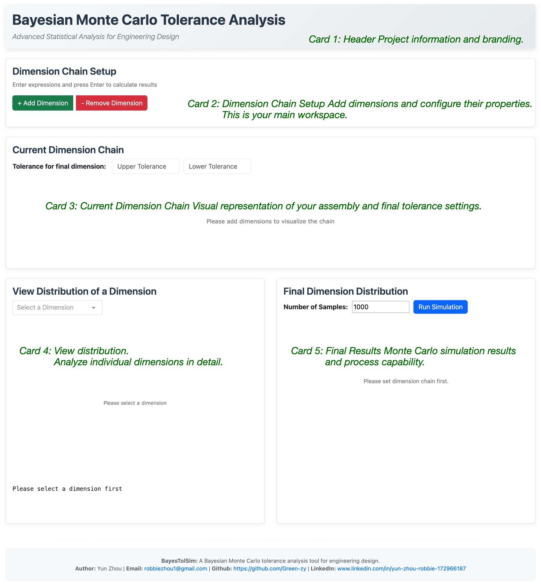
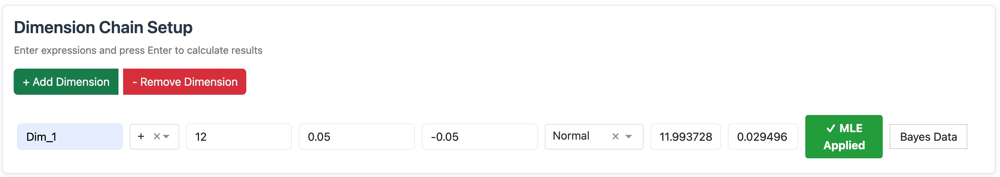
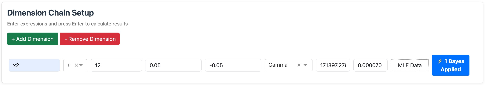
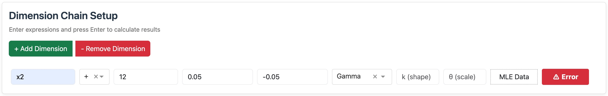

# Dashboard Overview

The BayesTolSim dashboard has 5 cards that guide you through tolerance analysis.

## Card Layout

## Interface Elements

### Buttons
- **Blue buttons**: Primary actions (Run Simulation)
- **Green buttons**: Add items (+ Add Dimension)
- **Red buttons**: Remove items (- Remove Dimension)

### Visual Feedback
- **Green**: Successful operations (MLE applied)

- **Blue**: Bayesian updates applied

- **Red**: Errors or warnings

### Interactive Features
- **Real-time updates**: Changes appear immediately
- **Hover information**: Move mouse over plots for details
- **Click interactions**: Click plots for additional analysis

**Next**: Learn [Dimension Setup](dimension-setup.md) to start building your analysis.