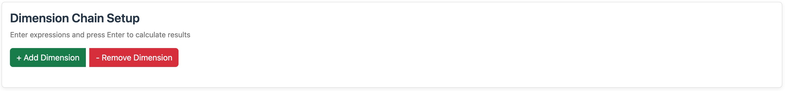
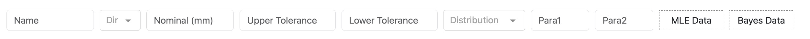
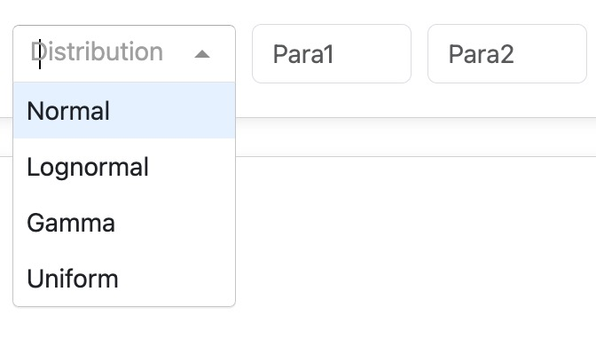
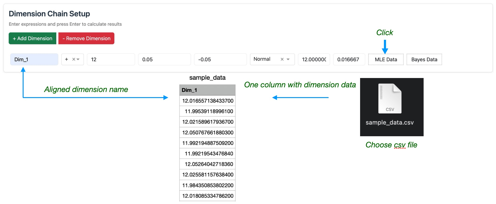
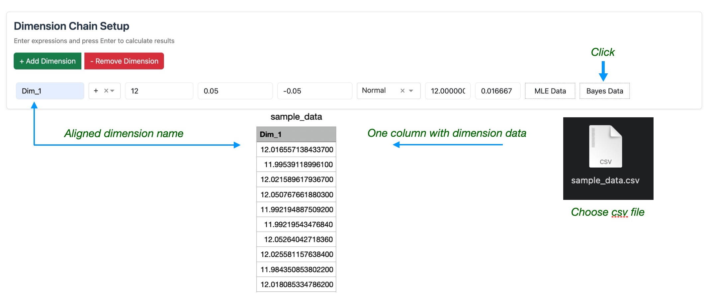
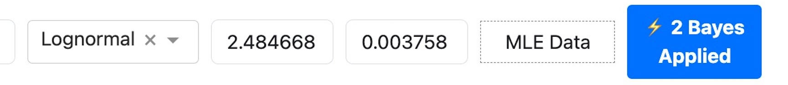
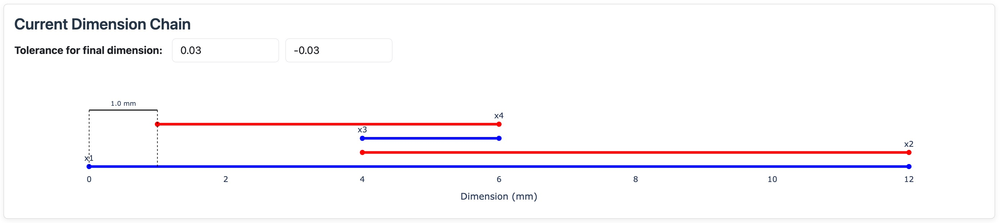

# Dimension Chain Setup

This is where you define the parts of your assembly. Each dimension represents a feature that affects the final assembly size.

## Adding Dimensions

- **+ Add Dimension**: Creates a new dimension
- **- Remove Dimension**: Removes the last dimension



## Input Fields



### 1. Name
Give each dimension a descriptive name:
- e.g.: "Shaft_Length", "Housing_Depth", "Bearing_Width"...

### 2. Direction
Choose how this dimension affects the assembly:

**+ (Plus)**: Adds to the final size  
**- (Minus)**: Subtracts from the final size  

### 3. Nominal Value
The target dimension from your drawings (in mm).

### 4. Tolerances

**Upper Tolerance**: Maximum allowed above nominal  
**Lower Tolerance**: Maximum allowed below nominal  

### 5. Distribution Type

Choose the statistical model for manufacturing variation:



**Normal** (Baseline for stable processes)  
- Foundation of Six Sigma analysis  
- Assumes purely random variation (no systematic machine bias or tool degradation)  
- Symmetric distribution centered at the target  
- Simple to compute and easy to interpret  
- Best for ideal, well-understood, and mature processes  

**Lognormal** (Realistic upgrade to Normal)  
- A more realistic model when measurements are **non-negative** and **right-skewed**  
- Ideal for real-world manufacturing, especially where **tool wear**, **friction**, or **accumulated variation** is present  
- Example: Hole diameters shrink over time as cutting tools wear down  
- Captures asymmetric variation and long-tail behavior better than Normal  

**Gamma** (Flexible modeling for complex or early-stage processes)  
- Highly flexible distribution shape — suitable for various skewed data  
- Especially useful during **early production** when **systematic errors**, equipment variation, or process drift are more likely  
- Captures non-random variation due to machine instability or operator variation  
- Recommended when the process is not yet stabilized or has mixed sources of variation  

**Uniform** (Conservative or tightly controlled scenarios)  
- Assumes equal probability across the tolerance range  
- Appropriate for **highly controlled** or **intentionally conservative** estimations  
- Example: Precision grinding, calibrated fixtures with strict dimensional control  
- Useful when simulating worst-case stack-ups or when actual variation is minimal  


### 6. Parameters (Para1 & Para2)

The system automatically calculates these from your tolerances.  

#### **Normal Distribution**  
- **Para1 (μ)**: Nominal value  
- **Para2 (σ)**: Tolerance range ÷ 6  

#### **Lognormal Distribution**    
- **Para1 (μ)**: ln(nominal) - 0.5 × σ²  
- **Para2 (σ)**: ln(1 + (tolerance_range/nominal)²)^0.5  

#### **Gamma Distribution**    
- **Para1 (k)**: Shape parameter = (nominal/std_dev)²  
- **Para2 (θ)**: Scale parameter = std_dev²/nominal  

#### **Uniform Distribution**    
- **Para1 (a)**: Lower bound = Nominal + Lower tolerance  
- **Para2 (b)**: Upper bound = Nominal + Upper tolerance  

**Advanced**: You can override these with mathematical expressions if needed.

### 7. Data Upload

**MLE Data**: Upload production measurement data  
- File: CSV with single column  
- Column name must exactly match dimension name  
- Effect: Uses actual manufacturing data instead of design assumptions  

  
You can find a sample CSV file [here](https://github.com/Green-zy/BayesTolSim/blob/main/data/mle_sample_data.csv). Set Norminal = 12.  

**Bayes Data**: Upload prototype/trial data  
- File: CSV with single column  
- Prerequisite: Must set tolerances first  
- Effect: Combines design specs with trial measurements  



You can find a sample CSV file [here](https://github.com/Green-zy/BayesTolSim/blob/main/data/bayes_sample_data.csv). Set Norminal = 12.  

- You can iteratively upload new data to update the posterior in Bayesian method. The button will reflect the times you've updated the model.



**Important**: You can use either MLE or Bayesian on a dimension, but not both.

## Chain Visualization

The plot shows your dimension stack-up:  
- **Blue lines**: + (additive) dimensions  
- **Red lines**: - (subtractive) dimensions  
- **Total**: Final assembly dimension  



## Final Tolerances

Before running simulation, specify acceptable limits for the complete assembly:  

**Upper Tolerance**: Maximum acceptable deviation above nominal final dimension  
**Lower Tolerance**: Maximum acceptable deviation below nominal final dimension  

These are used to calculate:  
- Process capability (Cp, Cpk)  
- Defect rates  

## CSV File Format

If uploading data, use this exact format:

```
Dimension_Name
25.0023
24.9987
25.0156
24.9945
```


**Next**: Learn about [Distribution Analysis](distribution-analysis.md) to examine your dimensions in detail.