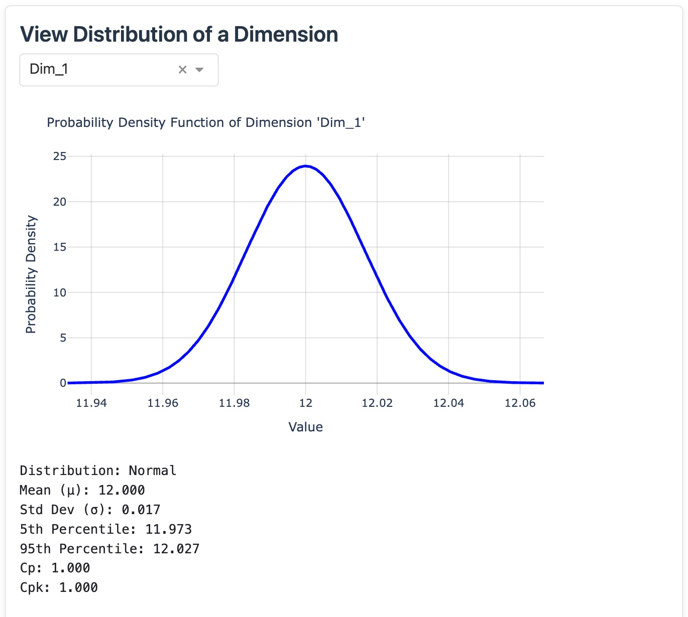
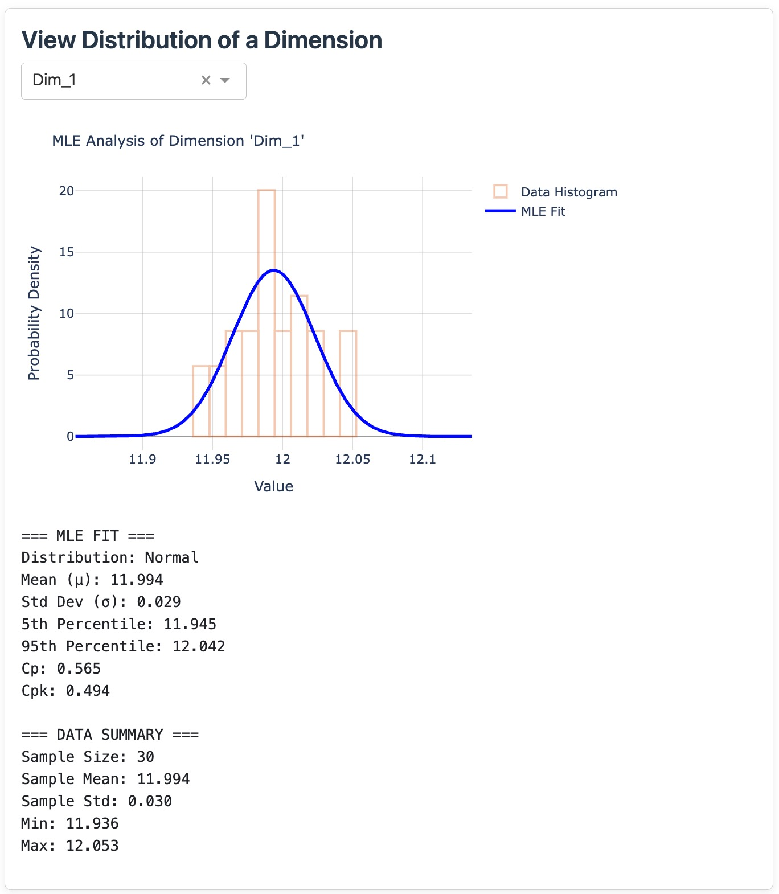
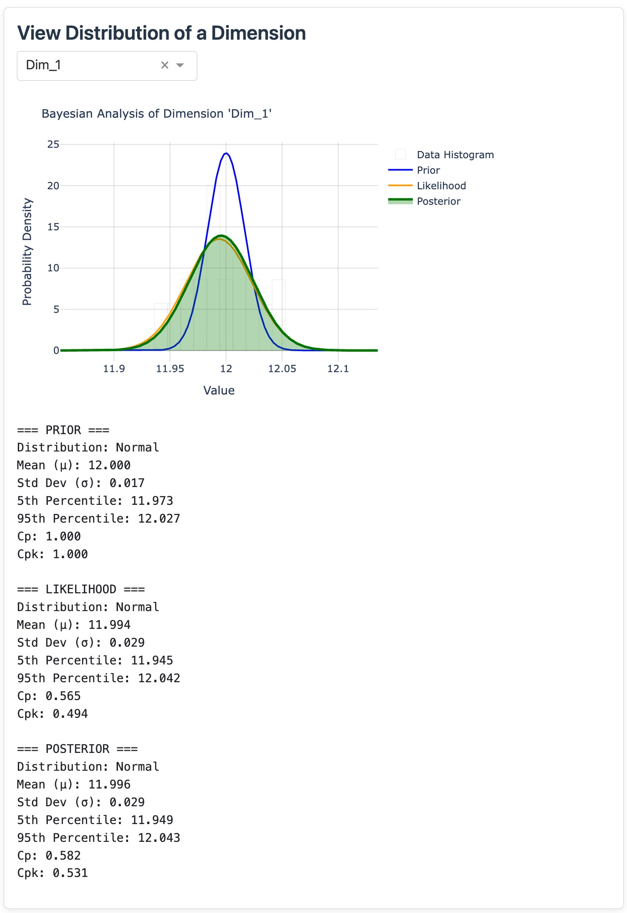

# Distribution Analysis

This section lets you examine individual dimensions in detail before running the full simulation.

## Selecting a Dimension

Use the dropdown to select any dimension you've created. The dropdown shows the actual names you entered.

## What You'll See

### Default View (Tolerance-Based)  
- **Blue curve**: Shows the theoretical distribution based on your tolerances  
- **Statistics**: Mean, standard deviation, process capability  

### With MLE Data
- **Orange histogram**: Your actual measurement data
- **Blue curve**: Best-fit distribution to your data
- **Comparison**: See how reality compares to theory

### With Bayesian Data
- **Blue curve**: Your design assumptions (prior)
- **Orange curve**: What your trial data suggests (likelihood)  
- **Green area**: Combined knowledge (posterior)
- **Gray histogram (semi-transparent)**: Your actual measurements

## Plot Interactions

**Hover**: Move mouse over curves to see values including cumulative probability (CDF)  

## Interpreting the Results

### Distribution Shape
**Symmetric bell curve**: Good process control, no systematic issues, random variation  
**Skewed right**: Possible tool wear (holes) or accumulation of errors  
**Skewed left**: Possible tool wear for non-hole dimensions  
**Multiple peaks**: Multiple process modes  

### Method Comparison
**Design vs MLE**: What's the gap between your design assumptions and actual production?
**Prior vs Posterior**: How much did data affect your beliefs in design?  

## Common Issues

**Empty plot**: Check that parameters are set and positive
**Weird shape**: Verify distribution choice matches your process
**Poor fit**: Try different distribution or check data quality

## Quick Actions

- Compare different dimensions by switching dropdown selection
- Check if MLE results match your expectations
- Verify Bayesian updates make engineering sense
- Note any dimensions that need attention

**Next**: Learn about [Monte Carlo Simulation](monte-carlo.md) to get final assembly results.