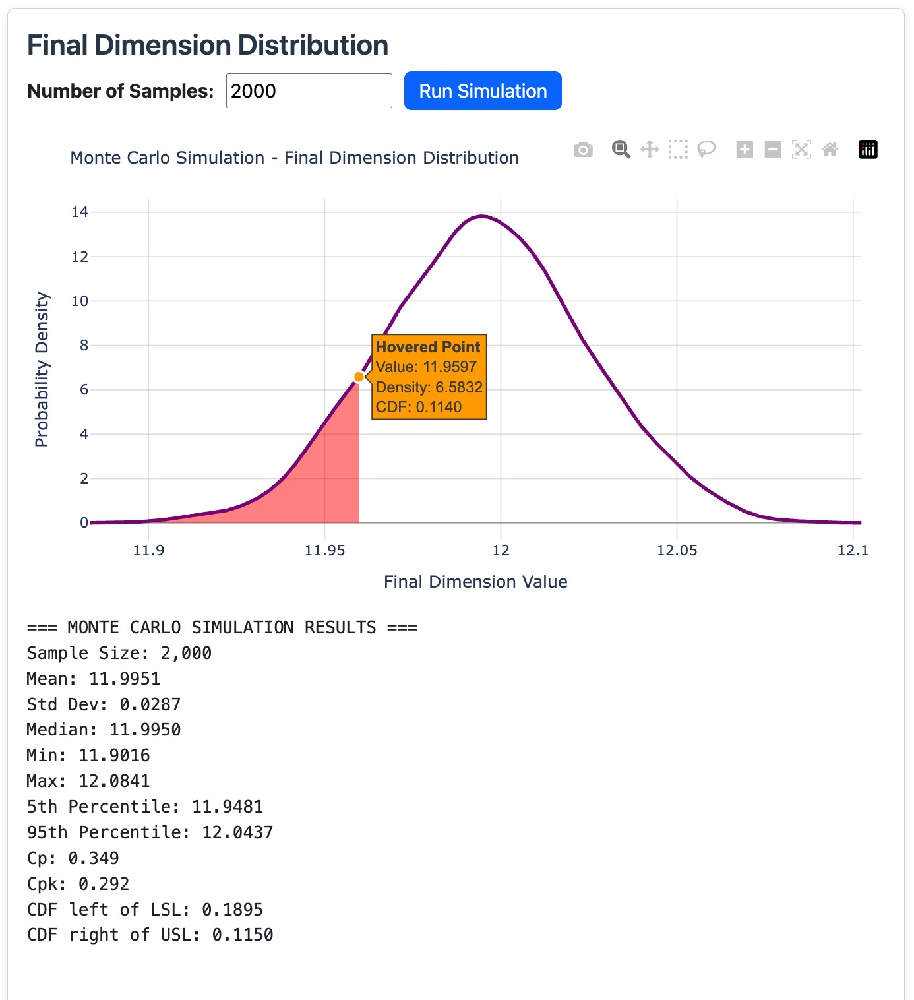

# Monte Carlo Simulation

This is where you run the final analysis to see how your complete assembly will perform.

## Before You Start

Make sure you have:  
- At least one dimension defined  
- Final dimension tolerances set (in Card 3)  
- All dimension parameters filled in  

## Sample Size

Sample size should reflect your production volume. However, sample size will affect the estimation accuracy.  
**Think of it as**: How many parts would you manufacture? More samples = more accurate results but takes longer.

## Running the Simulation

1. Set your sample size  
2. Click "Run Simulation"  

## Understanding Results

### The Purple Curve
Shows the distribution of your final assembly dimension.  

### Key Statistics

1. **Mean**: Average final dimension
2. **Std Dev**: Typical variation
3. **Median**: Middle value of distribution
4. **Min/Max**: Extreme values in simulation
5. **5th/95th Percentile**: Range containing 90% of assemblies  
6. **Cp**: Process capability  
    - **> 1.33**: Good (capable process)  
    - **1.0 - 1.33**: Marginal (monitor closely)  
    - **< 1.0**: Poor (process cannot meet requirements)  
7. **Cpk**: Process capability with centering  
    - **> 1.33**: Good and well-centered  
    - **Much less than Cp**: Process off-center  
8. **CDF left of LSL**: Percentage of undersized assemblies  
9. **CDF right of USL**: Percentage of oversized assemblies  

## Plot Interactions

**Hover**: Move mouse over curve to see probability information and cumulative probability up to that point (red shaded area)  

## Results Interpretation

### Shape Analysis
**Bell curve**: Normal, well-controlled assembly process  
**Skewed**: One or more dimensions contribute asymmetric variation  
**Multiple peaks**: Check individual dimensions for issues  

## Engineering Actions

### If Results Are Good
- Document the successful configuration
- Consider if tolerances could be relaxed to save cost
- Use this process for similar assemblies

### If Results Are Poor
- Identify which dimensions contribute most variation
- Tighten control on critical dimensions
- Consider alternative manufacturing methods
- Relax design tolerances if functionally acceptable

### If Results Are Marginal
- Implement process monitoring
- Consider slight improvements
- Plan for quality control measures

## Common Issues

**No results**: Check that final tolerances are set  
**Unrealistic results**: Verify dimension setup and parameters  
**Simulation takes too long**: Reduce sample size for testing  

**Next**: Explore more about [Statistical Methods](../methods/six-sigma.md).